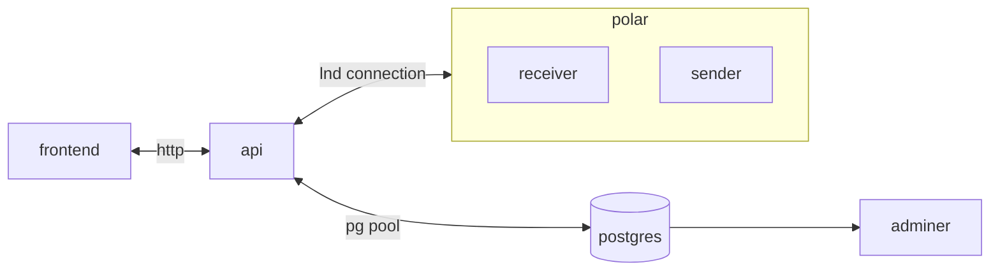
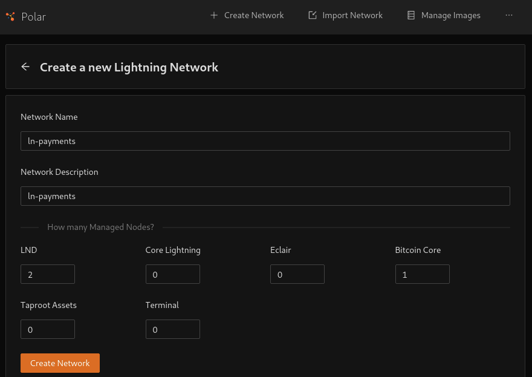
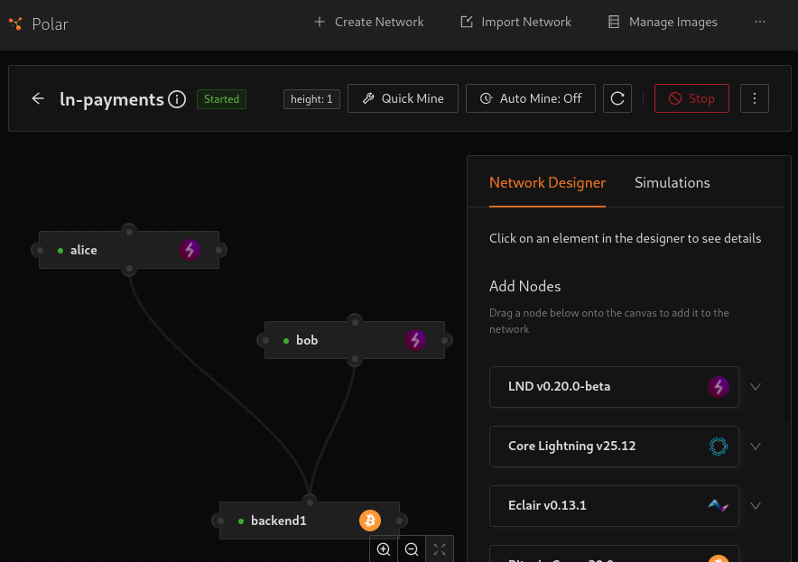
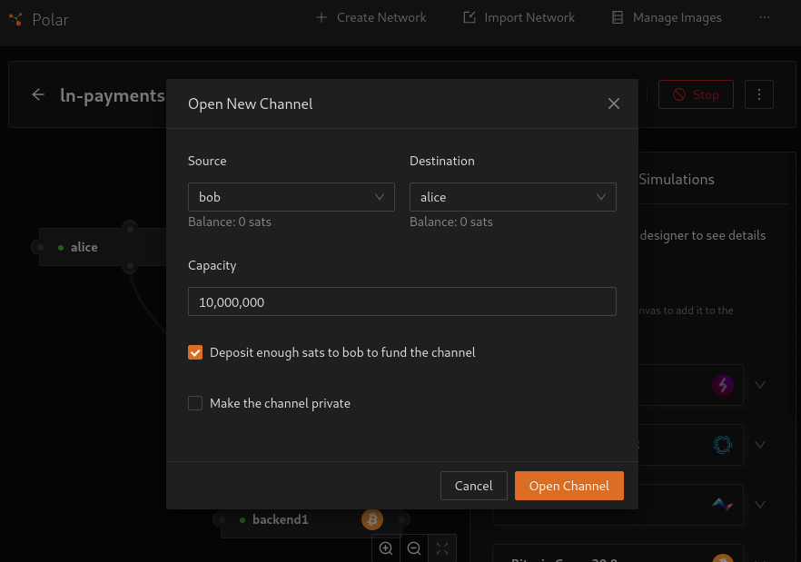
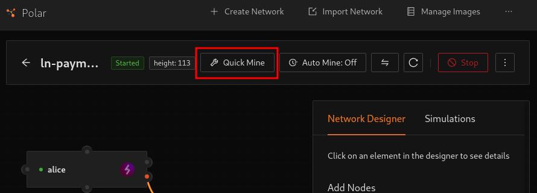

# ln-payments

Full-stack application that enables Lightning Network invoice payments.

1. [overall architecture](#overall-architecture)
2. [deployment](#deployment)
    1. [polar configuration](#polar-configuration)
    2. [services connfiguration](#services-configuration)
    3. [launch services](#launch-services)
3. [development](#development)
4. [applications documentation](#applications-documentation)

## overall architecture



* [Polar](https://lightningpolar.com/) - One-click Bitcoin Lightning networks for local app development & testing.
* [api](./apps/api/README.md) - RESTful API to connect to Lightning nodes.
* [frontend](./apps/frontend/README.md) - React + Vite UI to interact with LN payments.
* [postgres](https://www.postgresql.org/) - Relational database to persist LN transactions.
* [adminer](https://www.adminer.org/en/) - Database management.

## deployment

### polar configuration

[Polar](https://lightningpolar.com/) is a one-click Bitcoin Lightning networks for local app development & testing. In order to get up and running, follow the above steps:

1. Download and install Polar in the [official site](https://lightningpolar.com/). For Unix-like machines that can execute `AppImage`s, download and execute:

```bash
chmod u+x /path/to/polar-linux-x86_64-v4.0.0.AppImag
./path/to/polar-linux-x86_64-v4.0.0.AppImag
```

2. Create a network with 2 LND and 1 Bitcoin Core.



3. Start the network. Can take several minutes to pull Docker images and run them.



4. Create a channel between node Bob and Alice.



5. Perform a quick mine to verify the network.



6. Edit [`apps/api/.env.example`](./apps/api/.env.example) to fit connection data for each node (HEX encoded).

### services configuration

Each service has its own `.env.example` environment file. This examples will work as provided just renaming to `.env` in the following paths:

* [`.env.example`](./.env.example) - Postgres creation variables.

| Name | Description | Default |
|---|---|---|
| POSTGRES_USER | Postgres user name | postgres |
| POSTGRES_PASSWORD | Postgres user password | postgres-password |
| POSTGRES_DB | Postgres databse name | ln-payments |

* [`apps/api/.env.example`](./apps/api/.env.example) - Please refer to [api README](./apps/api/README.md).

| Name | Description | Default |
|---|---|---|
| RECEIVER_SOCKET | Receiver URL | polar-n1-bob:10009 |
| RECEIVER_CERT | Receiver HEX encoded TLS cert | Some TLS cert |
| RECEIVER_MACAROON | Receiver HEX encoded admin macaroon | Some admin macaroon |
| RECEIVER_PUBLIC_KEY | Receiver public key | Some public key |
| SENDER_SOCKET | Sender URL | polar-n1-alice:10009 |
| SENDER_CERT | Sender HEX encoded TLS cert | Some TLS cert |
| SENDER_MACAROON | Sender HEX encoded admin macaroon | Some admin macaroon |
| SENDER_PUBLIC_KEY | Sender public key | Some public key |
| POSTGRES_HOST | Postgre host to connect with | postgres |
| UI_PORT | UI listen port to enable socket.io CORS | 4000 |

> Note: above hostnames are resolved internally to the attached Docker network. If yoy have any other Polar network running minor changes will be required to fit `RECEIVER_SOCKET`, `SENDER_SOCKET` and network at [compose.yaml](./compose.yaml) assigning the correct `id` to `polar-n<id>-bob`, `polar-n<id>-alice` and `polar-network-<id>_default` respectively. Check can be done executing `docker ps` and looking for polar sevices.

* [`apps/frontend/.env.example`](./apps/api/.env.example) - Please refer to [frontend README](./apps/frontend/README.md).

| Name | Description | Default |
|---|---|---|
| VITE_API_URL | api service URL | http://api:3000 |

Please, modify to fit your needs.

### launch services

To launch services launch compose file:

```bash
docker compose up -d --build
```

The access to the [frontend](http://localhost:4000) using a web browser.

## development

Even not necessary for Dockerized deployments, some dependencies are needed for development purpose:

* [Node.js](https://nodejs.org/en/download) and npm.
* [Nx](https://nx.dev/docs/getting-started/installation).

Applications can be deployed for development purposes as follows:

```bash
npm i

# serve api
nx serve api

# serve frontend
nx serve frontend
```

## applications documentation

Please refer to [api](./apps/api/README.md) and [frontend](./apps/frontend/README.md) README files.
